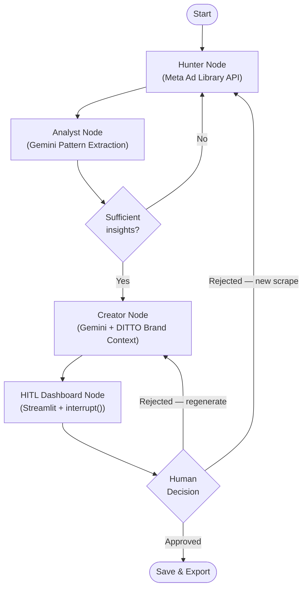

## Ditto Brief B — Meta Ads Automation

This project implements **Brief B: Meta Ads Automation** as a cyclic workflow (LangGraph) that:
- **Scrapes** long-running competitor ads from the **Meta Ad Library API**
- **Extracts patterns** (hook format, offer framing, emotional angle, etc.) using **Gemini**
- **Generates DITTO-branded concepts** grounded in DITTO brand guidance and optional product images
- **Routes through a HITL review** (Streamlit) for approve / regenerate / re-scrape decisions

### System flow (LangGraph)



### “Real output”
- **Raw scraped ads**: exported to `output/ads/` per run (JSON)
- **Pattern report**: exported to `output/reports/` (JSON + Markdown)
- **Generated concepts**: exported to `output/concepts/` (JSON)
- **Review UI**: Streamlit review screen (concept cards + scraper sample table)

### Setup

1) Install dependencies

```bash
pip3 install -r requirements.txt
```

2) Add environment variables

Copy `.env.example` → `.env` and set:
- `META_ACCESS_TOKEN` (Meta Ad Library API token with `ads_read`)
- `GEMINI_API_KEY`

Optional:
- `GEMINI_MODEL_ANALYST` / `GEMINI_MODEL_GENERATOR` (defaults are fine)

3) Configure competitors

Edit `data/competitors.json` and paste **Meta Ad Library advertiser page IDs** (numbers) for each competitor.

### Run

```bash
streamlit run main.py
```

Open the app at the local URL (Streamlit prints it in the terminal), then click **Start Pipeline**.

### Ground generation with DITTO product images (optional)

Put DITTO product/brand images in:
- `data/ditto_assets/`

If present, the Generator attaches them to Gemini so visual prompts and tone align more closely with real packaging.

